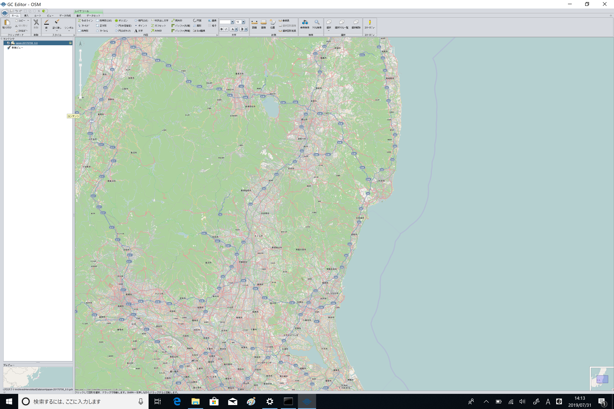
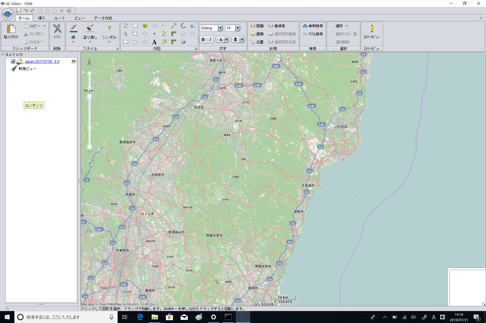
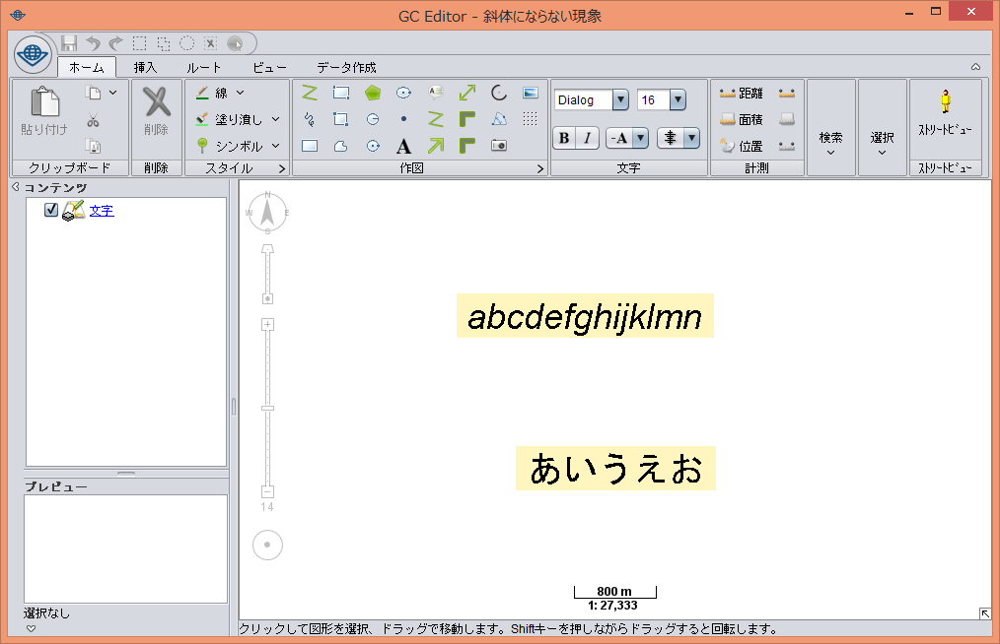
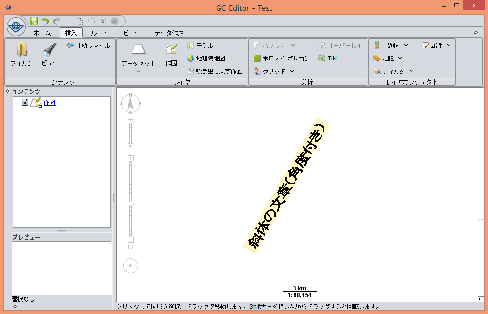
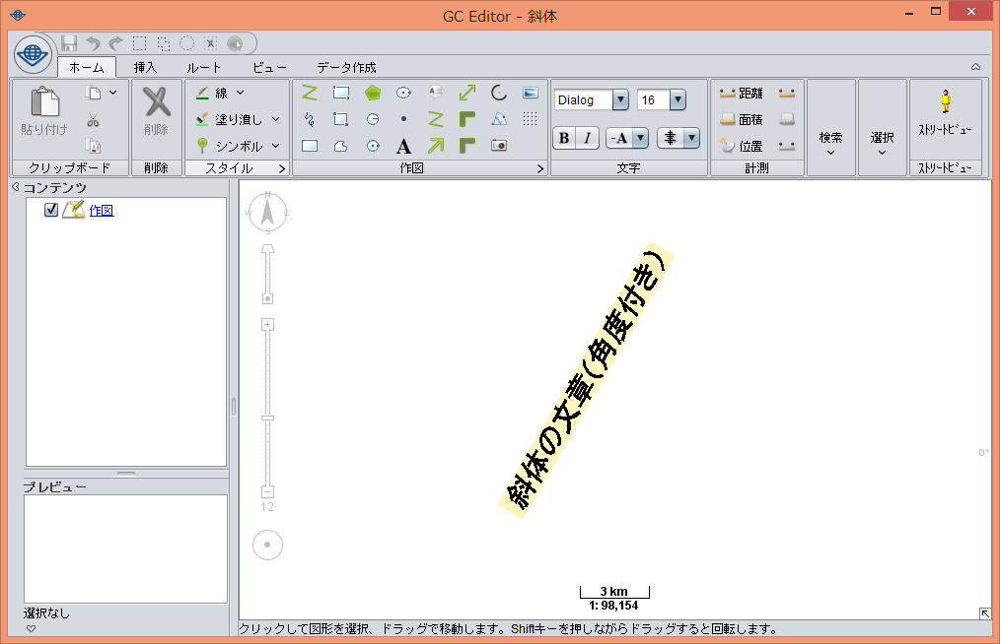
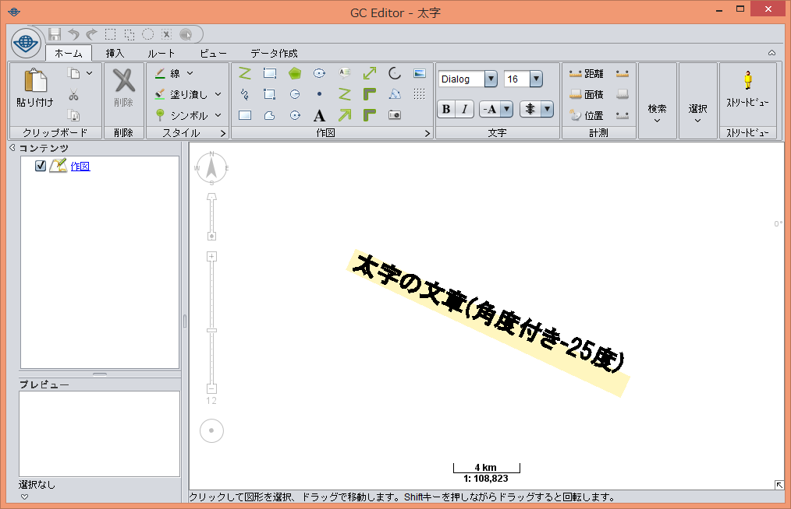
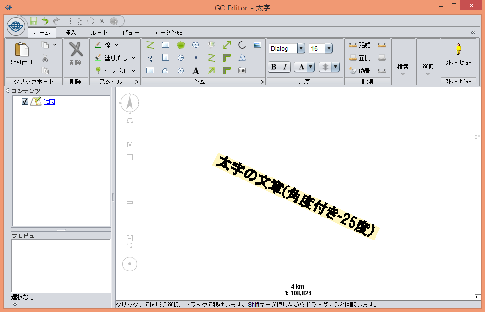

# GC Runtime
株式会社Informatixの製品「GeoConic」「GC Server」等の動作を保証するランタイムです。  
Adoptiumのソースを取得し、修正を加えたものを公開しています。  
（**オリジナルのAdoptiumでは[下記](#修正済の不具合)の不具合が起こります。**）  

- 2024/10/16  
Adoptiumのソースを[21.0.2+13](https://github.com/adoptium/jdk21u/tree/jdk-21.0.2+13)に変更しました。  
ビルド番号：**21.0.2_002**

## 修正済の不具合
各ビルドごとに修正した内容についてまとめています。  
新しいビルドには前のビルドまでの修正も反映されています。

### 21.0.2_002 (21.0.2+13)
- Javaの脆弱性問題に対応。

- タッチパネルにおいてピンチイン・インチアウトしても拡大縮小しない問題を修正。

- 高解像度の端末において一部の弊社製品を起動すると、文字やボタンが極端に小さく表示されてレイアウトが崩れる問題を修正。  
    |修正前|修正後|
    |:---:|:---:|
    |||

- 「ＭＳ ゴシック」等で表示した文字に斜体を適用しても反映されない問題を修正。  
※以前、既知の不具合として載せていた現象で、Adoptium側で修正されました。
    |修正前|修正後|
    |:---:|:---:|
    |||

- 斜体の文章に角度がついていると、斜体にならず一文字ずつ斜めに傾く問題を修正。  
※以前、既知の不具合として載せていた現象で、Adoptium側で修正されました。
    |修正前|修正後|
    |:---:|:---:|
    |||

- 太字で描かれた角度のある文章が、本来の描画位置よりも斜めに描かれてしまう問題を修正。  
※以前、既知の不具合として載せていた現象で、Adoptium側で修正されました。
    |修正前|修正後|
    |:---:|:---:|
    |||

